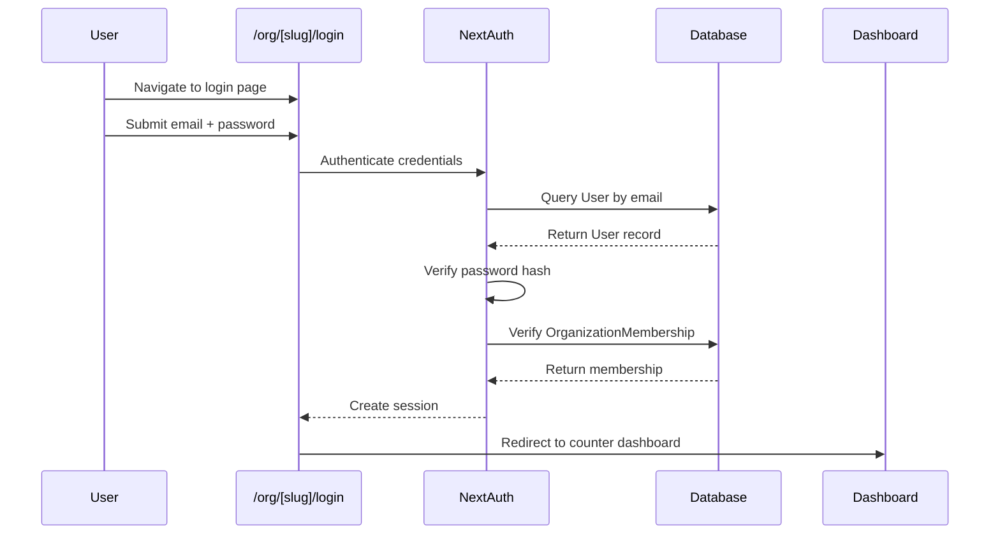
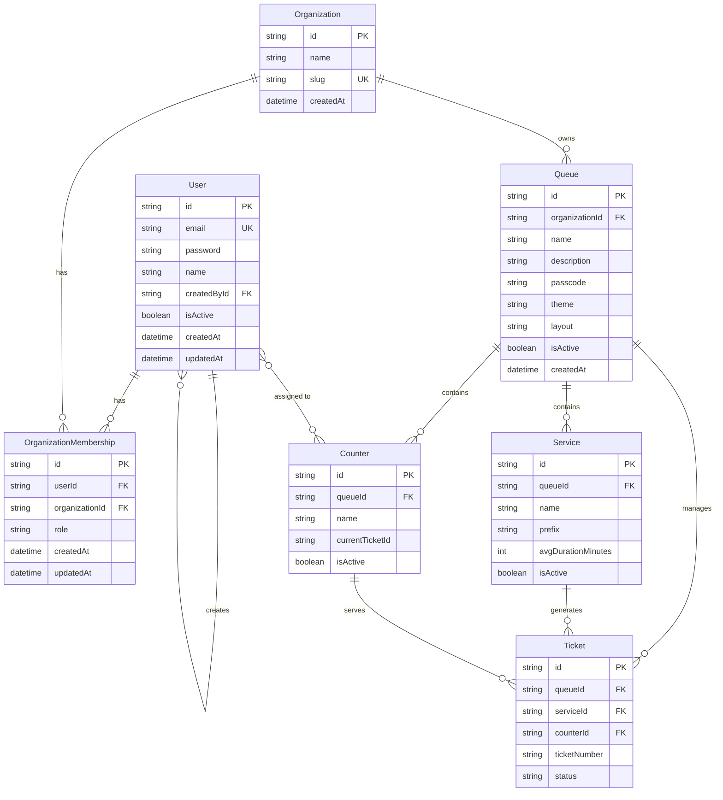

# Queue Management System - Technical Design Document

## Overview

The Queue Management System provides comprehensive CRUD operations for managing organization members, queues, services, counters, and staff assignments. The system follows a layered architecture pattern with clear separation between validation, data access, business logic, and presentation layers.

### Key Features

- **Member Management**: Create, update, and remove organization members with role-based access control (owner, admin, staff)
- **Queue Management**: Create, update, and delete queues with theme and layout customization
- **Service Management**: Define services within queues with unique ticket prefixes
- **Counter Management**: Create and manage service counters where staff serve customers
- **Staff Assignment**: Assign staff members to specific counters
- **Staff Portal**: Dedicated authentication portal at `/org/[slug]/login` for staff access
- **Role-Based Authorization**: Three-tier permission system (owner, admin, staff)

### Technology Stack

- **Framework**: Next.js 16 (App Router)
- **Database**: SQLite with Prisma ORM
- **Authentication**: NextAuth.js v5
- **Validation**: Zod
- **UI Components**: shadcn/ui
- **Styling**: Tailwind CSS
- **Password Hashing**: bcryptjs

## Architecture

### Layered Architecture Pattern

The system follows a strict layered architecture to ensure maintainability, testability, and separation of concerns:

```
┌─────────────────────────────────────────────────────────┐
│                    Presentation Layer                    │
│  (React Server Components, Client Components, Forms)    │
└─────────────────────────────────────────────────────────┘
                           ↓
┌─────────────────────────────────────────────────────────┐
│                      Action Layer                        │
│        (Next.js Server Actions - "use server")          │
│  - Session validation                                    │
│  - FormData parsing                                      │
│  - Input validation (Zod)                                │
│  - Path revalidation                                     │
└─────────────────────────────────────────────────────────┘
                           ↓
┌─────────────────────────────────────────────────────────┐
│                     Service Layer                        │
│              (Business Logic & Rules)                    │
│  - Authorization checks                                  │
│  - Business rule enforcement                             │
│  - Data constraint validation                            │
│  - Error handling                                        │
└─────────────────────────────────────────────────────────┘
                           ↓
┌─────────────────────────────────────────────────────────┐
│                   Repository Layer                       │
│              (Data Access with Prisma)                   │
│  - Database queries                                      │
│  - Transaction management                                │
│  - Relationship loading                                  │
└─────────────────────────────────────────────────────────┘
                           ↓
┌─────────────────────────────────────────────────────────┐
│                      Database Layer                      │
│                  (SQLite + Prisma)                       │
└─────────────────────────────────────────────────────────┘
```


### Data Flow

1. **User Interaction** → User submits form or triggers action
2. **Server Action** → Validates session, parses FormData, validates with Zod
3. **Service Layer** → Checks authorization, enforces business rules
4. **Repository Layer** → Executes database operations via Prisma
5. **Response** → Returns ActionResult<T> with success/failure
6. **UI Update** → Revalidates paths, redirects if needed, displays feedback

### Authentication Flow



## Components and Interfaces

### Validator Layer (Zod Schemas)

Location: `src/server/validators/`

#### Member Validators (`member.validator.ts`)

```typescript
// Create member schema
createMemberSchema = {
  name: string (min: 2, max: 50),
  email: string (email format, lowercase, trim),
  password: string (min: 8, max: 100),
  role: enum("owner", "admin", "staff"),
  organizationId: string (cuid)
}

// Update member schema
updateMemberSchema = {
  id: string (cuid),
  name?: string (min: 2, max: 50),
  email?: string (email format, lowercase, trim),
  role?: enum("owner", "admin", "staff")
}

// Delete member schema
deleteMemberSchema = {
  id: string (cuid),
  organizationId: string (cuid)
}
```


#### Queue Validators (`queue.validator.ts`)

```typescript
// Create queue schema
createQueueSchema = {
  name: string (min: 2, max: 100),
  description?: string (max: 500),
  passcode?: string (min: 4, max: 20),
  organizationId: string (cuid)
}

// Update queue schema
updateQueueSchema = {
  id: string (cuid),
  name?: string (min: 2, max: 100),
  description?: string (max: 500),
  passcode?: string (min: 4, max: 20) | null,
  theme?: object,
  layout?: object
}

// Delete queue schema
deleteQueueSchema = {
  id: string (cuid)
}
```

#### Service Validators (`service.validator.ts`)

```typescript
// Create service schema
createServiceSchema = {
  name: string (min: 2, max: 100),
  prefix: string (regex: /^[A-Z0-9]{1,4}$/, uppercase letters/numbers only),
  avgDurationMinutes?: number (min: 1, max: 480),
  queueId: string (cuid)
}

// Update service schema
updateServiceSchema = {
  id: string (cuid),
  name?: string (min: 2, max: 100),
  prefix?: string (regex: /^[A-Z0-9]{1,4}$/),
  avgDurationMinutes?: number (min: 1, max: 480) | null
}

// Delete service schema
deleteServiceSchema = {
  id: string (cuid)
}
```

#### Counter Validators (`counter.validator.ts`)

```typescript
// Create counter schema
createCounterSchema = {
  name: string (min: 1, max: 50),
  queueId: string (cuid)
}

// Update counter schema
updateCounterSchema = {
  id: string (cuid),
  name: string (min: 1, max: 50)
}

// Delete counter schema
deleteCounterSchema = {
  id: string (cuid)
}
```


#### Assignment Validators (`assignment.validator.ts`)

```typescript
// Assign staff to counter schema
assignStaffSchema = {
  userId: string (cuid),
  counterId: string (cuid),
  organizationId: string (cuid)
}

// Unassign staff from counter schema
unassignStaffSchema = {
  userId: string (cuid),
  counterId: string (cuid)
}
```

### Repository Layer (Prisma)

Location: `src/server/repositories/`

#### Member Repository (`member.repo.ts`)

```typescript
// Create member with organization membership
createMember(userData: {
  name: string,
  email: string,
  password: string
}, organizationId: string, role: string, createdById: string): Promise<User>

// Update member user data
updateMemberUser(userId: string, data: {
  name?: string,
  email?: string
}): Promise<User>

// Update member role
updateMemberRole(userId: string, organizationId: string, role: string): Promise<OrganizationMembership>

// Delete member (removes membership, optionally deletes user)
deleteMember(userId: string, organizationId: string): Promise<void>

// Get organization members with details
getOrganizationMembers(organizationId: string): Promise<Array<{
  user: User,
  membership: OrganizationMembership
}>>

// Find member by email in organization
findMemberByEmail(email: string, organizationId: string): Promise<User | null>

// Check if user has other memberships
hasOtherMemberships(userId: string, excludeOrgId: string): Promise<boolean>

// Check if user was created by another user
wasCreatedByAnotherUser(userId: string): Promise<boolean>
```


## Data Models

The system uses Prisma ORM with SQLite to manage the following core entities:

### User

Represents a user account in the system. Users can be members of multiple organizations.

```typescript
model User {
  id: string (cuid, primary key)
  name: string | null
  email: string | null (unique)
  password: string | null (bcrypt hashed)
  emailVerified: DateTime | null
  image: string | null
  isActive: boolean (default: true)
  createdById: string | null (foreign key to User.id)
  createdAt: DateTime (default: now)
  updatedAt: DateTime (auto-updated)
  
  // Relations
  accounts: Account[]
  sessions: Session[]
  authenticators: Authenticator[]
  memberships: OrganizationMembership[]
  createdBy: User | null (self-referential)
  createdUsers: User[] (self-referential)
}
```

**Key Constraints:**
- Email must be unique across all users
- Password is hashed using bcryptjs before storage
- createdById tracks which user created this user (for staff members created by admins/owners)
- Self-referential relationship allows tracking user creation hierarchy

### Organization

Represents a business entity that operates queues.

```typescript
model Organization {
  id: string (cuid, primary key)
  name: string
  slug: string (unique)
  createdAt: DateTime (default: now)
  
  // Relations
  memberships: OrganizationMembership[]
  queues: Queue[]
  subscriptions: Subscription[]
}
```

**Key Constraints:**
- Slug must be unique across all organizations
- Slug is used in URLs (e.g., `/org/[slug]/login`)

### OrganizationMembership

Links users to organizations with role-based access control.

```typescript
model OrganizationMembership {
  id: string (cuid, primary key)
  userId: string (foreign key to User.id)
  organizationId: string (foreign key to Organization.id)
  role: string (default: "staff") // "owner" | "admin" | "staff"
  createdAt: DateTime (default: now)
  updatedAt: DateTime (auto-updated)
  
  // Relations
  user: User (cascade delete)
  organization: Organization (cascade delete)
}
```

**Key Constraints:**
- Unique constraint on (userId, organizationId) - a user can only have one membership per organization
- Cascade delete: when User or Organization is deleted, membership is automatically removed
- Role values: "owner", "admin", "staff"

**Role Permissions:**
- **owner**: Full access including organization deletion
- **admin**: All operations except organization deletion, cannot remove owners
- **staff**: Read-only access to assigned counters and queue information

### Queue

Represents a customer service queue within an organization.

```typescript
model Queue {
  id: string (cuid, primary key)
  organizationId: string (foreign key to Organization.id)
  name: string
  description: string | null
  passcode: string | null (hashed)
  theme: string (JSON as string, default: "{}")
  layout: string (JSON as string, default: "{}")
  isActive: boolean (default: true)
  createdAt: DateTime (default: now)
  
  // Relations
  organization: Organization
  services: Service[]
  queueSessions: QueueSession[]
  tickets: Ticket[]
  counters: Counter[]
  displayScreens: DisplayScreen[]
}
```

**Key Constraints:**
- Queue names should be unique within an organization (enforced at application level)
- theme and layout are stored as JSON strings for SQLite compatibility
- passcode is optional and hashed if provided
- Cannot be deleted if active tickets exist

### Service

Represents a type of service offered within a queue.

```typescript
model Service {
  id: string (cuid, primary key)
  queueId: string (foreign key to Queue.id)
  name: string
  prefix: string (1-4 uppercase letters/numbers)
  avgDurationMinutes: number | null
  isActive: boolean (default: true)
  
  // Relations
  queue: Queue
  tickets: Ticket[]
}
```

**Key Constraints:**
- Service names must be unique within a queue (enforced at application level)
- Service prefixes must be unique within a queue (enforced at application level)
- Prefix format: /^[A-Z0-9]{1,4}$/ (1-4 uppercase letters or numbers)
- Cannot be deleted if active tickets exist

**Examples:**
- Service: "General Inquiry", Prefix: "GI"
- Service: "Account Opening", Prefix: "AO"
- Service: "Technical Support", Prefix: "TS"

### Counter

Represents a service window or station where staff serve customers.

```typescript
model Counter {
  id: string (cuid, primary key)
  queueId: string (foreign key to Queue.id)
  name: string
  currentTicketId: string | null
  isActive: boolean (default: true)
  
  // Relations
  queue: Queue
  assignedStaff: User[] (many-to-many, implicit join table)
}
```

**Key Constraints:**
- Counter names must be unique within a queue (enforced at application level)
- Cannot be deleted if staff members are assigned
- currentTicketId tracks the ticket currently being served at this counter

### Entity Relationship Diagram



### Data Integrity Rules

1. **Cascade Deletion:**
   - Deleting an Organization cascades to all Queues, Services, Counters, and Memberships
   - Deleting a Queue cascades to all Services and Counters
   - Deleting a User or Organization cascades to OrganizationMembership

2. **Soft Deletion:**
   - Users, Queues, Services, and Counters use `isActive` flag for soft deletion
   - Allows historical data preservation while hiding inactive entities

3. **Referential Integrity:**
   - All foreign keys are enforced by Prisma
   - Orphaned records are prevented through cascade rules

4. **Business Rules:**
   - Queues cannot be deleted if active tickets exist
   - Services cannot be deleted if active tickets exist
   - Counters cannot be deleted if staff are assigned
   - Admins cannot remove owners
   - Users are only deleted if they have no other memberships and were created by another user

## Error Handling

The system implements a comprehensive error handling strategy across all layers to ensure graceful failure and clear user feedback.

### Error Handling Architecture

```
┌─────────────────────────────────────────────────────────┐
│                    Presentation Layer                    │
│  - Display user-friendly error messages                 │
│  - Show toast notifications or inline alerts            │
│  - Maintain form state on validation errors             │
└─────────────────────────────────────────────────────────┘
                           ↑
┌─────────────────────────────────────────────────────────┐
│                      Action Layer                        │
│  - Catch and transform errors                           │
│  - Return ActionResult<T> with error messages           │
│  - Log detailed errors to server console                │
└─────────────────────────────────────────────────────────┘
                           ↑
┌─────────────────────────────────────────────────────────┐
│                     Service Layer                        │
│  - Throw descriptive business logic errors              │
│  - Validate authorization and constraints               │
│  - Return fail() responses for business rule violations │
└─────────────────────────────────────────────────────────┘
                           ↑
┌─────────────────────────────────────────────────────────┐
│                   Repository Layer                       │
│  - Catch Prisma errors                                  │
│  - Throw descriptive database errors                    │
│  - Handle constraint violations                         │
└─────────────────────────────────────────────────────────┘
```

### Error Categories

#### 1. Validation Errors

**Source:** Zod schema validation in Action Layer

**Examples:**
- Invalid email format
- Password too short (< 8 characters)
- Service prefix invalid format
- Required fields missing
- Field length violations

**Handling:**
```typescript
// Action Layer
const result = createMemberSchema.safeParse(data);
if (!result.success) {
  return fail(result.error.errors[0].message);
}
```

**User Message:** Specific validation error (e.g., "Email must be a valid email address")

#### 2. Authorization Errors

**Source:** Service Layer permission checks

**Examples:**
- Staff member attempting admin operation
- Admin attempting to remove owner
- User not member of organization
- Insufficient permissions for operation

**Handling:**
```typescript
// Service Layer
if (membership.role === "staff") {
  return fail("You don't have permission to perform this action");
}

if (membership.role === "admin" && targetRole === "owner") {
  return fail("Admins cannot remove organization owners");
}
```

**User Message:** "You don't have permission to perform this action"

#### 3. Business Rule Violations

**Source:** Service Layer constraint validation

**Examples:**
- Deleting queue with active tickets
- Deleting service with active tickets
- Deleting counter with assigned staff
- Duplicate email in organization
- Duplicate service prefix in queue
- Duplicate counter name in queue

**Handling:**
```typescript
// Service Layer
const activeTickets = await repo.countActiveTickets(queueId);
if (activeTickets > 0) {
  return fail("Cannot delete queue with active tickets. Please complete or cancel all tickets first.");
}

const existingMember = await repo.findMemberByEmail(email, organizationId);
if (existingMember) {
  return fail("A member with this email already exists in the organization");
}
```

**User Messages:**
- "Cannot delete queue with active tickets. Please complete or cancel all tickets first."
- "A member with this email already exists in the organization"
- "Cannot delete counter with assigned staff. Please unassign staff first."
- "A service with this prefix already exists in this queue"

#### 4. Database Errors

**Source:** Repository Layer Prisma operations

**Examples:**
- Unique constraint violations
- Foreign key constraint violations
- Connection errors
- Transaction failures

**Handling:**
```typescript
// Repository Layer
try {
  return await prisma.user.create({ data });
} catch (error) {
  if (error.code === 'P2002') {
    throw new Error(`A record with this ${error.meta.target} already exists`);
  }
  if (error.code === 'P2003') {
    throw new Error('Referenced record does not exist');
  }
  throw new Error('Database operation failed');
}
```

**User Message:** "An error occurred. Please try again" (generic for security)

#### 5. Authentication Errors

**Source:** NextAuth and Staff Portal

**Examples:**
- Invalid credentials
- No organization membership
- Session expired
- Missing session

**Handling:**
```typescript
// Staff Portal
const user = await authenticateUser(email, password);
if (!user) {
  return { error: "Invalid email or password" };
}

const membership = await findMembership(user.id, organizationId);
if (!membership) {
  return { error: "You are not a member of this organization" };
}
```

**User Messages:**
- "Invalid email or password"
- "You are not a member of this organization"
- "Your session has expired. Please log in again"

#### 6. Network and System Errors

**Source:** Any layer

**Examples:**
- Network timeouts
- Server errors
- Unexpected exceptions

**Handling:**
```typescript
// Action Layer
try {
  const result = await serviceLayer.operation();
  return result;
} catch (error) {
  console.error('Unexpected error:', error);
  return fail("An unexpected error occurred. Please try again");
}
```

**User Message:** "An error occurred. Please try again"

### Error Response Format

All server actions return a standardized `ActionResult<T>` type:

```typescript
type ActionResult<T> = 
  | { success: true; data: T }
  | { success: false; error: string };

// Helper functions
function ok<T>(data: T): ActionResult<T> {
  return { success: true, data };
}

function fail<T>(error: string): ActionResult<T> {
  return { success: false, error };
}
```

### Error Logging Strategy

**Server-Side Logging:**
- All errors logged to server console with full stack traces
- Sensitive information (passwords, tokens) never logged
- Include context: user ID, organization ID, operation attempted

**Client-Side Logging:**
- User-friendly messages displayed in UI
- No sensitive information exposed to client
- No stack traces sent to client

**Example:**
```typescript
// Server logs (detailed)
console.error('Failed to create member:', {
  error: error.message,
  stack: error.stack,
  userId: session.user.id,
  organizationId: data.organizationId,
  operation: 'createMember'
});

// Client receives (sanitized)
return fail("Failed to create member. Please check the email address and try again");
```

### Error Recovery Strategies

1. **Validation Errors:** User corrects input and resubmits
2. **Authorization Errors:** User contacts admin for permission upgrade
3. **Business Rule Violations:** User resolves dependencies (e.g., removes tickets before deleting queue)
4. **Database Errors:** Automatic retry for transient errors, user retry for persistent errors
5. **Authentication Errors:** User re-authenticates
6. **Network Errors:** Automatic retry with exponential backoff

### User Feedback Mechanisms

**Toast Notifications:**
- Success: Green toast with checkmark icon
- Error: Red toast with error icon
- Duration: 5 seconds for success, 10 seconds for errors

**Inline Alerts:**
- Form validation errors displayed below input fields
- Page-level errors displayed at top of form
- Persistent until user corrects issue

**Confirmation Dialogs:**
- Displayed before destructive operations (delete)
- Explain consequences and dependencies
- Require explicit user confirmation

## Testing Strategy

The Queue Management System employs a comprehensive testing strategy that combines unit tests, integration tests, and end-to-end tests to ensure correctness, reliability, and maintainability.

### Testing Approach Overview

**Note on Property-Based Testing:** This feature is **NOT suitable for property-based testing** because:
- It is primarily a CRUD application with database operations
- Most operations involve external dependencies (database, authentication)
- Business logic consists of straightforward validation and authorization checks
- Testing focuses on integration between layers rather than algorithmic correctness
- There are no pure functions with universal properties that hold across infinite input spaces

Property-based testing is most valuable for parsers, serializers, data transformations, and algorithms with universal invariants. This system's correctness depends on proper integration of layers, database constraints, and business rule enforcement, which are better validated through example-based unit tests and integration tests.

**Testing Strategy:**
- **Unit Tests**: Validate individual functions and business logic with specific examples
- **Integration Tests**: Verify layer interactions and database operations with real database
- **End-to-End Tests**: Validate complete user workflows through browser automation

### Test Framework and Tools

- **Test Runner**: Vitest (fast, modern, TypeScript-native)
- **Assertion Library**: Vitest built-in assertions
- **Mocking**: Vitest mocking utilities
- **Database Testing**: In-memory SQLite for fast, isolated tests
- **E2E Testing**: Playwright for browser automation
- **Coverage Tool**: Vitest coverage (c8)

### Unit Testing Strategy

**Scope:** Individual functions in isolation with mocked dependencies

**Target Coverage:** 80%+ for business logic functions

#### Validator Layer Tests

Location: `src/server/validators/__tests__/`

**Test Cases:**
```typescript
// member.validator.test.ts
describe('createMemberSchema', () => {
  it('should accept valid member data', () => {
    const valid = {
      name: 'John Doe',
      email: 'john@example.com',
      password: 'password123',
      role: 'staff',
      organizationId: 'cuid123'
    };
    expect(createMemberSchema.parse(valid)).toEqual(valid);
  });

  it('should reject email with invalid format', () => {
    const invalid = { ...validData, email: 'not-an-email' };
    expect(() => createMemberSchema.parse(invalid)).toThrow();
  });

  it('should reject password shorter than 8 characters', () => {
    const invalid = { ...validData, password: 'short' };
    expect(() => createMemberSchema.parse(invalid)).toThrow();
  });

  it('should reject invalid role', () => {
    const invalid = { ...validData, role: 'invalid' };
    expect(() => createMemberSchema.parse(invalid)).toThrow();
  });

  it('should trim and lowercase email', () => {
    const input = { ...validData, email: '  JOHN@EXAMPLE.COM  ' };
    const result = createMemberSchema.parse(input);
    expect(result.email).toBe('john@example.com');
  });
});

// service.validator.test.ts
describe('createServiceSchema', () => {
  it('should accept valid service prefix', () => {
    const valid = { ...validData, prefix: 'GI' };
    expect(createServiceSchema.parse(valid)).toEqual(valid);
  });

  it('should reject prefix with lowercase letters', () => {
    const invalid = { ...validData, prefix: 'gi' };
    expect(() => createServiceSchema.parse(invalid)).toThrow();
  });

  it('should reject prefix longer than 4 characters', () => {
    const invalid = { ...validData, prefix: 'TOOLONG' };
    expect(() => createServiceSchema.parse(invalid)).toThrow();
  });

  it('should reject prefix with special characters', () => {
    const invalid = { ...validData, prefix: 'G!' };
    expect(() => createServiceSchema.parse(invalid)).toThrow();
  });
});
```

#### Service Layer Tests

Location: `src/server/services/__tests__/`

**Test Cases:**
```typescript
// member.service.test.ts
describe('MemberService', () => {
  let mockRepo: MockedRepository;
  let service: MemberService;

  beforeEach(() => {
    mockRepo = createMockRepository();
    service = new MemberService(mockRepo);
  });

  describe('createMember', () => {
    it('should create member with valid data', async () => {
      mockRepo.findMemberByEmail.mockResolvedValue(null);
      mockRepo.createMember.mockResolvedValue(mockUser);

      const result = await service.createMember(validData, session);

      expect(result.success).toBe(true);
      expect(mockRepo.createMember).toHaveBeenCalledWith(
        expect.objectContaining({ email: validData.email }),
        validData.organizationId,
        validData.role,
        session.user.id
      );
    });

    it('should reject if email already exists in organization', async () => {
      mockRepo.findMemberByEmail.mockResolvedValue(existingUser);

      const result = await service.createMember(validData, session);

      expect(result.success).toBe(false);
      expect(result.error).toContain('already exists');
    });

    it('should reject if user is not admin or owner', async () => {
      const staffSession = { ...session, membership: { role: 'staff' } };

      const result = await service.createMember(validData, staffSession);

      expect(result.success).toBe(false);
      expect(result.error).toContain('permission');
    });
  });

  describe('deleteMember', () => {
    it('should reject if admin tries to remove owner', async () => {
      const adminSession = { ...session, membership: { role: 'admin' } };
      mockRepo.getMemberRole.mockResolvedValue('owner');

      const result = await service.deleteMember(userId, orgId, adminSession);

      expect(result.success).toBe(false);
      expect(result.error).toContain('cannot remove');
    });

    it('should delete user if no other memberships and created by another user', async () => {
      mockRepo.hasOtherMemberships.mockResolvedValue(false);
      mockRepo.wasCreatedByAnotherUser.mockResolvedValue(true);

      await service.deleteMember(userId, orgId, ownerSession);

      expect(mockRepo.deleteMember).toHaveBeenCalledWith(userId, orgId);
    });
  });
});

// queue.service.test.ts
describe('QueueService', () => {
  describe('deleteQueue', () => {
    it('should reject if queue has active tickets', async () => {
      mockRepo.countActiveTickets.mockResolvedValue(5);

      const result = await service.deleteQueue(queueId, session);

      expect(result.success).toBe(false);
      expect(result.error).toContain('active tickets');
    });

    it('should delete queue if no active tickets', async () => {
      mockRepo.countActiveTickets.mockResolvedValue(0);

      const result = await service.deleteQueue(queueId, session);

      expect(result.success).toBe(true);
      expect(mockRepo.deleteQueue).toHaveBeenCalledWith(queueId);
    });
  });
});
```

### Integration Testing Strategy

**Scope:** Multiple layers working together with real database

**Target Coverage:** All critical user workflows

#### Repository Integration Tests

Location: `src/server/repositories/__tests__/`

**Test Cases:**
```typescript
// member.repo.integration.test.ts
describe('MemberRepository Integration', () => {
  let prisma: PrismaClient;
  let repo: MemberRepository;

  beforeEach(async () => {
    prisma = new PrismaClient({ datasources: { db: { url: ':memory:' } } });
    await prisma.$connect();
    repo = new MemberRepository(prisma);
  });

  afterEach(async () => {
    await prisma.$disconnect();
  });

  it('should create member with organization membership', async () => {
    const org = await prisma.organization.create({ data: orgData });
    const creator = await prisma.user.create({ data: creatorData });

    const member = await repo.createMember(
      { name: 'John', email: 'john@example.com', password: 'hashed' },
      org.id,
      'staff',
      creator.id
    );

    expect(member.id).toBeDefined();
    expect(member.createdById).toBe(creator.id);

    const membership = await prisma.organizationMembership.findFirst({
      where: { userId: member.id, organizationId: org.id }
    });

    expect(membership).toBeDefined();
    expect(membership.role).toBe('staff');
  });

  it('should enforce unique email constraint', async () => {
    await prisma.user.create({ data: { email: 'john@example.com' } });

    await expect(
      prisma.user.create({ data: { email: 'john@example.com' } })
    ).rejects.toThrow();
  });

  it('should cascade delete membership when user is deleted', async () => {
    const user = await prisma.user.create({ data: userData });
    const org = await prisma.organization.create({ data: orgData });
    await prisma.organizationMembership.create({
      data: { userId: user.id, organizationId: org.id, role: 'staff' }
    });

    await prisma.user.delete({ where: { id: user.id } });

    const membership = await prisma.organizationMembership.findFirst({
      where: { userId: user.id }
    });

    expect(membership).toBeNull();
  });
});
```

#### Server Action Integration Tests

Location: `src/server/actions/__tests__/`

**Test Cases:**
```typescript
// member.action.integration.test.ts
describe('Member Actions Integration', () => {
  it('should create member through full stack', async () => {
    const session = await createTestSession('owner');
    const formData = new FormData();
    formData.append('name', 'John Doe');
    formData.append('email', 'john@example.com');
    formData.append('password', 'password123');
    formData.append('role', 'staff');
    formData.append('organizationId', testOrg.id);

    const result = await createMemberAction(formData);

    expect(result.success).toBe(true);
    expect(result.data.email).toBe('john@example.com');

    // Verify in database
    const user = await prisma.user.findUnique({
      where: { email: 'john@example.com' }
    });
    expect(user).toBeDefined();
  });

  it('should reject duplicate email in organization', async () => {
    await createTestMember('john@example.com', testOrg.id);

    const formData = createFormData({
      email: 'john@example.com',
      organizationId: testOrg.id
    });

    const result = await createMemberAction(formData);

    expect(result.success).toBe(false);
    expect(result.error).toContain('already exists');
  });
});
```

### End-to-End Testing Strategy

**Scope:** Complete user workflows through browser

**Target Coverage:** Critical user journeys

#### E2E Test Cases

Location: `tests/e2e/`

**Test Cases:**
```typescript
// member-management.e2e.test.ts
test.describe('Member Management', () => {
  test('owner can create, edit, and delete staff member', async ({ page }) => {
    await page.goto('/login');
    await loginAsOwner(page);
    await page.goto('/dashboard/organizations/test-org/members');

    // Create member
    await page.click('button:has-text("Add Member")');
    await page.fill('input[name="name"]', 'John Doe');
    await page.fill('input[name="email"]', 'john@example.com');
    await page.fill('input[name="password"]', 'password123');
    await page.selectOption('select[name="role"]', 'staff');
    await page.click('button:has-text("Create")');

    await expect(page.locator('text=John Doe')).toBeVisible();
    await expect(page.locator('text=Member created successfully')).toBeVisible();

    // Edit member
    await page.click('button[aria-label="Edit John Doe"]');
    await page.fill('input[name="name"]', 'John Smith');
    await page.click('button:has-text("Save")');

    await expect(page.locator('text=John Smith')).toBeVisible();

    // Delete member
    await page.click('button[aria-label="Delete John Smith"]');
    await page.click('button:has-text("Confirm")');

    await expect(page.locator('text=John Smith')).not.toBeVisible();
  });

  test('admin cannot remove owner', async ({ page }) => {
    await loginAsAdmin(page);
    await page.goto('/dashboard/organizations/test-org/members');

    const ownerRow = page.locator('tr:has-text("Owner")');
    await expect(ownerRow.locator('button[aria-label*="Delete"]')).toBeDisabled();
  });
});

// staff-portal.e2e.test.ts
test.describe('Staff Portal', () => {
  test('staff member can login and access counter dashboard', async ({ page }) => {
    await page.goto('/org/test-org/login');

    await page.fill('input[name="email"]', 'staff@example.com');
    await page.fill('input[name="password"]', 'password123');
    await page.click('button:has-text("Login")');

    await expect(page).toHaveURL('/org/test-org/counter');
    await expect(page.locator('text=Counter Dashboard')).toBeVisible();
  });

  test('shows error for invalid credentials', async ({ page }) => {
    await page.goto('/org/test-org/login');

    await page.fill('input[name="email"]', 'wrong@example.com');
    await page.fill('input[name="password"]', 'wrongpassword');
    await page.click('button:has-text("Login")');

    await expect(page.locator('text=Invalid email or password')).toBeVisible();
  });
});
```

### Test Data Management

**Test Database:**
- Use in-memory SQLite for unit and integration tests
- Seed with minimal required data
- Reset between tests for isolation

**Test Fixtures:**
```typescript
// fixtures/test-data.ts
export const testOrganization = {
  name: 'Test Organization',
  slug: 'test-org'
};

export const testOwner = {
  name: 'Test Owner',
  email: 'owner@example.com',
  password: 'hashedpassword'
};

export const testQueue = {
  name: 'Test Queue',
  description: 'A test queue',
  theme: '{}',
  layout: '{}'
};
```

### Coverage Goals

- **Overall Coverage**: 80%+
- **Validator Layer**: 95%+ (critical for data integrity)
- **Service Layer**: 85%+ (core business logic)
- **Repository Layer**: 80%+ (database operations)
- **Action Layer**: 75%+ (integration points)

### Continuous Integration

**CI Pipeline:**
1. Run linter (ESLint)
2. Run type checker (TypeScript)
3. Run unit tests
4. Run integration tests
5. Run E2E tests (on main branch only)
6. Generate coverage report
7. Fail if coverage drops below threshold

**Test Execution Time Goals:**
- Unit tests: < 10 seconds
- Integration tests: < 30 seconds
- E2E tests: < 5 minutes

### Testing Best Practices

1. **Arrange-Act-Assert Pattern**: Structure all tests clearly
2. **Test Isolation**: Each test should be independent
3. **Descriptive Names**: Test names should describe the scenario and expected outcome
4. **Mock External Dependencies**: Mock authentication, external APIs
5. **Test Edge Cases**: Empty strings, null values, boundary conditions
6. **Test Error Paths**: Verify error handling works correctly
7. **Avoid Test Interdependence**: Tests should not rely on execution order
8. **Keep Tests Fast**: Use in-memory database, minimize I/O
9. **Test User Workflows**: E2E tests should mirror real user behavior
10. **Maintain Test Data**: Keep fixtures up-to-date with schema changes
